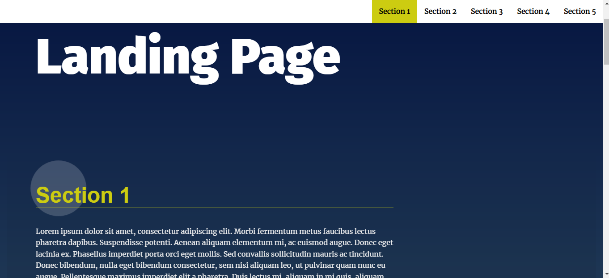
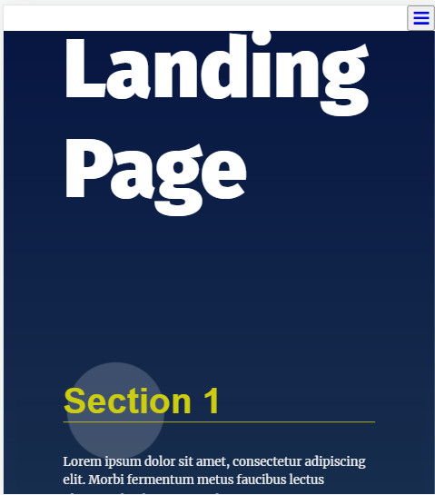
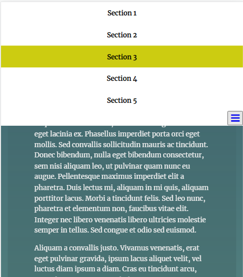
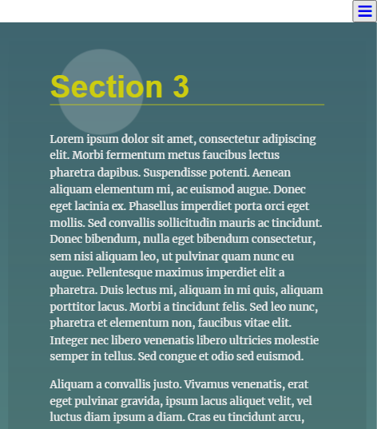
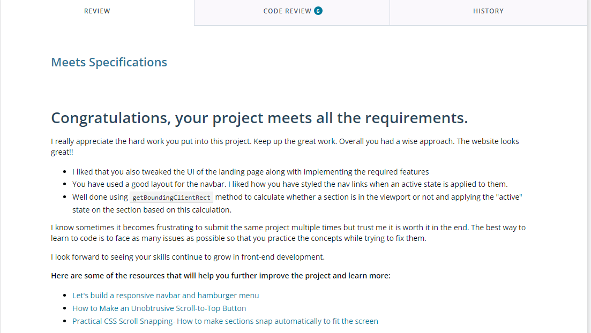

# Landing Page Project

## Demo-preview

[Link to the page](https://tarekelkanaria.github.io/landing-page)

This is the first project in Professional Front-End Web Development Nanodegree Program. This project aims to build real-world scenarios of manipulating the DOM.  
it builds multi-section landing page which anyone can dynamically add the content to the page. it demonstrating this with the navigation menu.

## Author

Tarek M. Abdelraouf Shaer

## Table of Contents

- Make changes to starter code provided by udacity in html:

  - Add two more sections in html to test my javaScript code.
  - Add a link to app.js in html code to apply my code.
  - delete default class from section-one to let javaScript control it.

- Make changes to starter code provided by udacity in css:

  - make the navbar in a responsive layout across all devices.
  - Style active class with a color similar to border color for better design.

- Build app.js file with javaScript code to manipulate the DOM:

  - Build a dynamic navigation menu that can increase or decrease in html with the same design in javaScript.
  - Create a smooth scrolling behavior once the link has been clicked.
  - Make active section to be clear which section is viewed when scrolling or clicking on the navigation menu.
  - The navigation bar will lead to the appropriate section to which it belongs.
  - Highlight the active section in the navigation bar.

- Responsive humburger menu collapsible on small screen.

- to top button in the end of the page to scroll to top

## Requirements

Meets Specifications Criteria for udacity instructions.

## Resources

<https://www.w3schools.com/css/css_rwd_mediaqueries.asp>

<https://developer.mozilla.org/en-US/docs/Web/API/Element/getBoundingClientRect>

<https://developer.mozilla.org/en-US/docs/Web/API/Event/preventDefault>

<https://developer.mozilla.org/en-US/docs/Glossary/IIFE>

<https://developer.mozilla.org/en-US/docs/Web/JavaScript/Reference/Functions/Arrow_functions>

<https://www.w3schools.com/howto/howto_js_topnav_responsive.asp>
